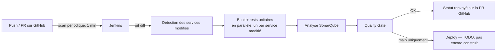

# CI/CD — Jenkins + SonarQube

[← Sommaire](00-getting-started.md)

## Démarrer en local

```bash
./scripts/start-ci.sh
```

Premier lancement : le script crée `infra/ci/.env` depuis `.env.example` et s'arrête — édite les mots de passe (admin, DB Sonar obligatoires ; `GITHUB_TOKEN`/`SONAR_TOKEN` peuvent rester vides pour l'instant), puis relance le script.

- ⚠️ Ce `.env` doit être **à côté de `docker-compose.yml`** (`infra/ci/.env`), pas dans `infra/ci/jenkins/` — Compose ne charge que celui du dossier où il tourne. Sans ça, `sonarqube-db` refuse de démarrer (mot de passe vide). Le script gère déjà ça correctement (il se place dans `infra/ci` avant de lancer Compose).

Jenkins → http://localhost:8090 · SonarQube → http://localhost:9000

## Réglages à faire une fois (pas automatisables)

### 1. Créer le job Jenkins

Item de type **Multibranch Pipeline**, pointé sur le repo GitHub, credential `github-token`.

**Behaviours à régler :**

| Réglage | Valeur | Pourquoi |
|---|---|---|
| Discover branches | `Exclude branches that are also filed as PRs` | évite de builder deux fois la même branche |
| Discover pull requests from origin | `Merging the pull request with the current target branch revision` | teste le vrai résultat du merge dans `main`, pas juste la branche isolée |
| Discover pull requests from forks | supprimé | repo public sans fork — builder des PR de forks inconnus exécuterait du code arbitraire avec accès aux secrets |

<details>
<summary>Générer le token GitHub (<code>github-token</code>)</summary>

GitHub → Settings → Developer settings → Personal access tokens → Tokens (classic) → Generate new token.

Une seule case : **`public_repo`** (pas `repo` complet — inutile, ça donnerait accès à tes repos privés). Ça suffit pour lire le code et poster les statuts de check.

Alternative plus stricte : un *fine-grained token* scopé au seul repo `travel-plan` (`Contents: Read`, `Commit statuses: Read and write`, `Metadata: Read`).

À ne pas confondre avec la "PR decoration" native de SonarQube (demande une vraie GitHub App) — optionnelle, pas nécessaire ici.
</details>

### 2. Webhook SonarQube → Jenkins

1. SonarQube démarré → génère un token (Administration → Security → Users → Tokens)
2. Colle-le dans `SONAR_TOKEN` de `infra/ci/.env`, relance `docker compose up -d`
3. SonarQube → Administration → Configuration → Webhooks → ajoute `http://jenkins:8080/sonarqube-webhook/`

Sans ce webhook, le stage `Quality Gate` attend indéfiniment (il attend une notification, pas un sondage en boucle).

### 3. Scan périodique

Job Multibranch → Configure → *Scan Multibranch Pipeline Triggers* → coche "Periodically if not otherwise run" → **1 minute**.

Jenkins rescanne le repo tout seul (nouvelles branches/commits), sans exposer aucun port depuis l'extérieur.

## Vue d'ensemble



## Ce qui est construit dans `infra/ci/`

- **`jenkins/Dockerfile` + `plugins.txt`** — image Jenkins avec les plugins nécessaires (Git, GitHub, Pipeline, deux plugins de vue distincts `pipeline-stage-view`/`pipeline-graph-view`, Docker Pipeline, SonarQube Scanner, Configuration as Code). Jenkins n'a **aucun accès à Docker** actuellement — `mvnw` tourne directement sur l'agent, `Validate infra` ne fait que de la syntaxe (détails plus bas).
- **`jenkins/casc.yaml`** — Configuration as Code : utilisateur admin, connexion SonarQube, credentials toujours injectés par variable d'env (jamais en dur).
- **`docker-compose.yml`** — Jenkins + SonarQube + sa base Postgres, avec un volume Maven partagé (`maven_repo` → `/var/jenkins_home/.m2`) pour ne pas retélécharger les dépendances à chaque build.

## Comment lire le Jenkinsfile

| Élément | Ce qu'il fait |
|---|---|
| `agent any` | tourne sur Jenkins lui-même, pas de machine de build séparée |
| `disableConcurrentBuilds()` | empêche deux builds du même job en parallèle |
| `checkout scm` | récupère la bonne révision (branche/PR) sans URL en dur — le même Jenkinsfile sert à tout le monde |
| `env.CHANGED_SERVICES` | liste des services touchés, calculée dans "Detect changed services", lue par les stages suivants |
| `env.INFRA_CHANGED` | même principe, pour tout ce qui n'est pas du Java (`docker-compose.yml`, `infra/`, le `Jenkinsfile` lui-même) |
| `sh(script: ..., returnStdout: true).trim()` | récupère la sortie shell comme texte manipulable en Groovy |
| `services.collectEntries { ... }` + `parallel(...)` | construit dynamiquement une branche parallèle par service touché — ajouter un 6ᵉ service ne demande qu'un dossier dans `backend/`, jamais de toucher au Jenkinsfile |
| `buildService`/`sonarService` | factorisent l'appel Maven (évite de le dupliquer 5 fois) ; lancent `./mvnw` **directement sur l'agent Jenkins**, pas dans un conteneur jetable |
| `withSonarQubeEnv('sonarqube')` | injecte l'URL/le token SonarQube sans les coder en dur |
| `waitForQualityGate abortPipeline: true` | met le build en pause jusqu'à la notification SonarQube (webhook), échoue si le quality gate ne passe pas |
| `when { expression {...} }` / `when { branch 'main' }` | conditionne l'exécution d'un stage à ce build précis |

Trois points qui méritent plus qu'une ligne dans le tableau :

- **`ls -d backend/*/ \| xargs -n1 basename`, pas `ls backend`** — un simple `ls` liste aussi les fichiers (un `Dockerfile` égaré a un jour traîné dans `backend/`, Jenkins a essayé de le traiter comme un 6ᵉ service et de faire `cd backend/Dockerfile`). Filtrer sur les dossiers rend la détection robuste à ce genre d'oubli.
- **`org.sonarsource.scanner.maven:sonar-maven-plugin:sonar`, pas le raccourci `sonar:sonar`** — Maven ne résout les raccourcis de plugin que pour une liste de groupes connus par défaut, qui n'inclut pas SonarQube. Le raccourci seul échoue (`No plugin found for prefix 'sonar'`) sauf à modifier un `settings.xml` global sur chaque machine — les coordonnées complètes évitent ça proprement.
- **Version dynamique plutôt que statique** — une version antérieure déclarait les 5 services en dur (5 blocs `stage` répétés). Le retour à la version dynamique n'était pas lié à un souci d'affichage Jenkins (fausse piste, corrigée depuis) : elle reste simplement plus simple à maintenir.

## Ce qui reste à faire (hors scope de cette étape)

- Le stage `Deploy` (build image + Ansible), une fois ces briques prêtes.
- Séparer tests unitaires (chaque push/PR) et tests d'intégration/E2E plus lourds (uniquement sur merge `main`), une fois qu'il y aura des tests d'intégration à faire tourner.

## Pourquoi ces choix

### Pourquoi cette étape est construite en premier
L'énoncé impose qu'une PR passe par Jenkins avant de pouvoir être mergée. Ce socle ne dépend d'aucune décision applicative (gateway, Vault...) — seul `Deploy` en dépendra, volontairement laissé en `TODO`.

### Pourquoi un scan périodique plutôt qu'un webhook
Un webhook demanderait que Jenkins soit joignable depuis internet — pas reproductible pour un coéquipier qui héberge sa propre instance. Le scan toutes les 1 minute ne demande aucune exposition réseau et reste largement assez réactif (très loin de la limite API GitHub, 5000 req/h).

### Pourquoi ne builder que les services modifiés
Les 5 microservices sont indépendants (pas de POM parent) : modifier `payment-service` n'a aucune raison de redéclencher les 4 autres. Le calcul se fait via `git diff` entre la base de la PR et `HEAD` (ou `HEAD~1` hors PR).

- **Exception : le `Jenkinsfile` lui-même** — s'il est modifié, tous les services sont testés, pas seulement ceux touchés. Sinon un bug introduit dans le pipeline passerait inaperçu tant qu'aucun code ne change.
- **`HEAD~1` n'affaiblit pas la protection de `main`** — tant qu'une PR est ouverte, chaque commit est comparé à `origin/main` cumulé sur toute la PR, pas juste au commit précédent. `HEAD~1` ne sert qu'aux builds directs sur `main` après un merge.
- **Règle d'équipe** : ouvrir la PR en *Draft* dès le premier push, même inachevée — ça bascule tout de suite en comparaison cumulée contre `main`, un service cassé reste visible jusqu'à correction.

### Pourquoi valider l'infra dans Jenkins
Une PR qui ne touche que `docker-compose.yml`/`infra/` a `CHANGED_SERVICES` vide → tout est sauté → check vert qui n'a rien vérifié. `Validate infra` comble ce trou avec `bash -n` sur chaque script `.sh` (repère les erreurs de syntaxe sans rien exécuter).

On a testé une version plus poussée (`docker compose up --wait` sur toute la stack, dans un projet isolé) — elle a réellement attrapé plusieurs bugs, mais demandait que Jenkins pilote le vrai daemon Docker (proxy dédié, permissions à ajuster une par une). Le coût de maintenance dépassait le bénéfice pour un projet testé à la main par un seul développeur avant chaque merge — retour à la syntaxe seule.

*Limite assumée* : ça ne vérifie pas que les conteneurs démarrent vraiment. Si ça redevient un vrai problème (plusieurs coéquipiers actifs), la bonne réponse sera Testcontainers, pas de refaire tourner `docker compose` depuis Jenkins.

### Pourquoi le stage `Deploy` est vide
Construire des images et appeler Ansible n'a de sens que quand ces briques existent. Le stage reste présent (branché sur `main`) pour que la structure du pipeline n'ait pas à être réécrite plus tard.

### Pourquoi `mvnw` tourne directement sur Jenkins
Isoler Maven dans un conteneur jetable n'apporte rien tant que les 5 services sont des coquilles Spring Initializr sans dépendance système à isoler. Un vrai choix technique reviendra le jour où ça change — pas une contrainte.

Le Dockerfile prépare aussi `/var/jenkins_home/.m2` (`chown jenkins:jenkins` avant de repasser en `USER jenkins`) : un volume Docker neuf appartient à `root` par défaut, sinon `mvnw` échoue au premier build (`mkdir: Permission denied`) dès que `maven_repo` est vide (premier lancement, ou après un `down -v`).

### Pourquoi Jenkins n'a aujourd'hui aucun accès à Docker
Le seul besoin identifié était la version "vraie stack" de `Validate infra`, abandonnée (voir plus haut). Sans besoin réel, donner un accès Docker à Jenkins — même via un proxy restreint — ajoute une surface d'attaque pour rien. Ce choix sera revisité quand `Deploy` construira de vraies images.

### Pourquoi les tests `contextLoads()` excluent la base de données
Les 5 services partent de coquilles Spring Initializr avec un seul test généré qui démarre tout le contexte Spring — et tente donc de se connecter à une vraie base, absente sur l'agent Jenkins (pas de stack applicative ici).

- `auth-service`/`payment-service`/`user-service` excluent `DataSourceAutoConfiguration` & co. (JPA/Postgres)
- `travel-service` exclut `Neo4jAutoConfiguration` & co.

Via `@EnableAutoConfiguration(exclude = {...})` avec de **vraies classes importées**, pas une chaîne de caractères (`spring.autoconfigure.exclude=...`) : une première version utilisait les noms de package Spring Boot 2.x/3.x, invalides depuis que Boot 4 a éclaté `spring-boot-autoconfigure` en modules par techno — une chaîne pointant vers une classe inexistante est silencieusement ignorée (pas d'erreur), ce qui a laissé 3 services échouer sans message clair. Une classe importée fait échouer la compilation immédiatement si elle est déplacée/renommée.

Ces exclusions seront remplacées par de vrais tests d'intégration (Testcontainers) dès qu'un vrai repository JPA/Neo4j existera — pas par un retour à `@SpringBootTest` nu.

### Pourquoi `infra/ci/` est séparé de `backend/`
Jenkins/SonarQube (infra CI, tourne en continu) et la stack applicative n'ont ni le même cycle de vie ni les mêmes dépendances — regroupées sous `infra/` pour séparer "ce qui fait tourner le système" de "ce que fait le système" (`backend/`).

Aucun problème de connectivité : Jenkins n'a pas besoin de joindre les conteneurs applicatifs par leur nom DNS pour construire/tester du code, et le futur `Deploy` pilotera la stack via Ansible. Un test qui aurait besoin d'une vraie instance Postgres/Neo4j utilisera Testcontainers plutôt qu'une stack partagée déjà démarrée.
