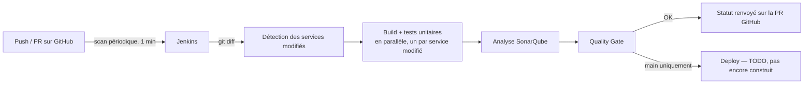

# CI/CD — Jenkins + SonarQube

[← Sommaire](00-getting-started.md)

## Lancer la stack CI en local

```powershell
cd infra/ci
Copy-Item .env.example .env
# éditer .env (à la racine de infra/ci, PAS dans jenkins/) : mot de passe admin,
# mot de passe DB Sonar obligatoires. GITHUB_TOKEN et SONAR_TOKEN peuvent
# rester vides pour l'instant (voir plus bas)
docker compose up -d --build
```

Le fichier `.env` doit être **à côté de `docker-compose.yml`** (`infra/ci/.env`),
pas dans `infra/ci/jenkins/` : Docker Compose ne charge automatiquement que le
`.env` situé dans le dossier où tu lances `docker compose`, jamais un `.env`
dans un sous-dossier. Sans lui au bon endroit, toutes les variables sont
vides et `sonarqube-db` (Postgres) refuse de démarrer sans mot de passe.

Jenkins : http://localhost:8090 — SonarQube : http://localhost:9000.

## Deux réglages manuels, une seule fois (pas automatisables simplement)

1. **Job Jenkins** : créer un item de type *Multibranch Pipeline*, pointé sur
   le repo GitHub (credential `github-token`, donc `GITHUB_TOKEN` doit être
   renseigné dans `.env` avant cette étape), stratégie de découverte incluant
   les Pull Requests — c'est ce qui permet à Jenkins de renvoyer un statut de
   check sur chaque PR, utilisé par la règle de protection de branche.

   Pour générer ce `GITHUB_TOKEN` (GitHub → Settings → Developer settings →
   Personal access tokens → Tokens (classic) → Generate new token) : le repo
   `travel-plan` étant **public**, une seule case à cocher, **`public_repo`**
   (pas le `repo` complet, qui donnerait aussi accès à tes repos privés sans
   raison) — elle inclut déjà l'accès en lecture/écriture au code et aux
   commit statuses pour les repos publics, donc Jenkins peut poster son
   statut de check sans scope plus large. Rien d'autre — pas `workflow`, pas
   `admin:org`, aucune des cases liées aux packages/codespaces/enterprise,
   sans rapport avec ce qu'on fait ici. Une alternative plus stricte (moindre
   privilège) : un *fine-grained token* scopé au seul repo `travel-plan` avec
   permissions "Contents: Read", "Commit statuses: Read and write",
   "Metadata: Read".

   À ne pas confondre avec la fonctionnalité native "PR decoration" de
   SonarQube (Administration → DevOps Platform Integrations), qui demande de
   créer une vraie GitHub App (App ID, Client ID, Client Secret, clé privée)
   — optionnelle, pas nécessaire pour que le check Jenkins fonctionne, à
   ignorer pour l'instant.

   Dans les *Behaviours* du job Multibranch Pipeline : "Discover branches"
   reste sur "Exclude branches that are also filed as PRs" (évite un double
   build de la même branche) ; "Discover pull requests from origin" passe en
   "Merging the pull request with the current target branch revision" (teste
   le résultat du merge réel dans `main`, pas juste la branche seule — c'est
   la seule validation qui garantit ce qui sera vraiment mergé) ; "Discover
   pull requests from forks" est supprimé (repo public mais l'équipe pousse
   ses branches directement dessus, pas de fork — et builder des PR de forks inconnus
   est un vecteur d'attaque classique en CI, exécution de code arbitraire
   avec accès aux secrets `GITHUB_TOKEN`/`SONAR_TOKEN`).
2. **Webhook SonarQube → Jenkins** : une fois SonarQube démarré, génère un
   token dans son UI (Administration → Security → Users → Tokens), colle-le
   dans `SONAR_TOKEN` de `infra/ci/.env`, relance `docker compose up -d`. Puis dans
   SonarQube, Administration → Configuration → Webhooks, ajoute
   `http://jenkins:8080/sonarqube-webhook/` — sans ça, le stage `Quality Gate`
   du Jenkinsfile attend indéfiniment (il attend une notification de
   SonarQube plutôt que de la sonder en boucle).
3. **Déclenchement automatique — scan périodique** : dans le job Multibranch
   Pipeline → Configure → *Scan Multibranch Pipeline Triggers* → coche
   "Periodically if not otherwise run" → intervalle **1 minute**. Jenkins
   rescanne le repo tout seul à cet intervalle (nouvelles branches, nouveaux
   commits sur les PR), sans aucune exposition réseau nécessaire.

## Vue d'ensemble



## Ce qui est construit dans `infra/ci/`

- `infra/ci/jenkins/Dockerfile` + `plugins.txt` : image Jenkins avec les
  plugins nécessaires (Git, GitHub, Pipeline, Docker Pipeline, SonarQube
  Scanner, Configuration as Code), et le **CLI Docker** copié depuis l'image
  officielle `docker:27-cli` (multi-stage build) — Jenkins tourne lui-même
  dans un conteneur et doit piloter le Docker de la machine hôte (via
  `/var/run/docker.sock` monté dans `docker-compose.yml`) pour lancer les
  conteneurs Maven éphémères du Jenkinsfile ; le socket seul ne suffit pas,
  il faut aussi le binaire `docker` à l'intérieur du conteneur Jenkins pour
  parler à ce socket ("Docker outside of Docker").
- `infra/ci/jenkins/casc.yaml` : configuration Jenkins as Code — utilisateur
  admin, connexion au serveur SonarQube, credentials injectés depuis les
  variables d'environnement (jamais en dur dans le fichier).
- `infra/ci/docker-compose.yml` : Jenkins + SonarQube + la base Postgres de
  SonarQube, avec un volume Maven partagé (`maven_repo`) pour ne pas
  retélécharger les dépendances à chaque build.

## Comprendre le Jenkinsfile

`pipeline { agent any ... }` — squelette général ; `agent any` = exécuté sur
Jenkins lui-même, pas de machine de build séparée.

`options { timestamps(); ansiColor('xterm'); disableConcurrentBuilds() }` —
`timestamps()` préfixe chaque ligne de log par l'heure, `ansiColor` affiche
les couleurs produites par certains outils, `disableConcurrentBuilds()`
empêche deux builds du même job de tourner en même temps.

`stage('Nom') { steps { ... } }` — une étape nommée, affichée comme une case
dans la vue graphique de Jenkins. `script { ... }` à l'intérieur est une
échappatoire vers du vrai Groovy (variables, boucles, conditions) — la
syntaxe déclarative pure est trop rigide pour ce qu'on fait dans "Detect
changed services" et "Build & Test".

`checkout scm` — récupère exactement la révision (branche ou PR) pour
laquelle Jenkins a été déclenché, en réutilisant la config du job (le repo
GitHub lié au Multibranch Pipeline) — pas d'URL en dur, le même Jenkinsfile
sert pour n'importe quelle branche ou PR.

`env.CHANGED_SERVICES = ...` — stocke une valeur dans une variable
d'environnement lisible par les stages suivants ; c'est le pont entre
"Detect changed services" et "Build & Test".

`sh(script: "...", returnStdout: true).trim()` — récupère la sortie d'une
commande shell comme une chaîne Groovy manipulable (`.split`, `.contains`,
`.findAll`) plutôt que de juste l'exécuter.

`stage('Build & Test') { parallel { stage('api-gateway') { when {...} steps {...} } ... } }`
— les 5 services sont déclarés **statiquement** (noms fixes dans le fichier),
chacun avec son propre `when` qui vérifie individuellement s'il fait partie
de `CHANGED_SERVICES` (`env.CHANGED_SERVICES.tokenize(',').contains('nom')`)
pour décider s'il doit tourner. Une version précédente générait ces stages
dynamiquement (`collectEntries` + `parallel` construit au runtime) — plus
courte à écrire, mais le plugin `pipeline-stage-view` (la vue "Pipeline
Overview" en blocs colorés) ne sait pas afficher des branches parallèles dont
les noms ne sont connus qu'à l'exécution. Le prix de la version statique :
ajouter un 6ᵉ service (ex. `discovery-service`) demande d'ajouter son bloc à
la main plutôt que ce soit automatique — accepté pour retrouver la
visualisation.

`docker.image('maven:...').inside('-v maven_repo:/root/.m2') { sh "..." }` —
plugin Docker Pipeline : démarre un conteneur jetable depuis cette image, y
monte automatiquement le workspace, exécute les commandes dedans, puis le
détruit. Nécessite le CLI `docker` dans le conteneur Jenkins (voir plus haut).
Les fonctions `buildService(svc)` / `sonarService(svc)` définies en haut du
Jenkinsfile (hors du bloc `pipeline { }`) évitent de dupliquer cet appel 5
fois pour le build et 5 fois pour l'analyse Sonar.

`withSonarQubeEnv('sonarqube') { ... }` — injecte l'URL et le token du
serveur SonarQube configuré dans Jenkins (JCasC), sans les coder en dur dans
l'appel `mvn sonar:sonar`.

`waitForQualityGate abortPipeline: true` — met le pipeline en pause (sans
sonder en boucle) jusqu'à ce que SonarQube notifie Jenkins via son webhook
que l'analyse est terminée, et échoue tout le build si le quality gate ne
passe pas.

`when { expression {...} }` / `when { branch 'main' }` — conditions qui
décident si un stage s'exécute pour ce build précis (pas de build/test/sonar
si aucun service backend n'a changé ; `Deploy` seulement sur `main`).

## Ce qui reste à faire (hors scope de cette étape)

- Le stage `Deploy` (build image + Ansible), une fois ces briques prêtes.
- Séparer tests unitaires (sur chaque push/PR) et tests d'intégration/E2E
  plus lourds (uniquement sur merge `main`), une fois qu'il y aura des tests
  d'intégration à faire tourner.

## Pourquoi cette étape est construite en premier

L'énoncé impose que chaque PR passe par une vérification Jenkins avant de
pouvoir être mergée sur `main` (règle de protection de branche déjà en place
côté GitHub). Ce socle ne dépend d'aucune décision d'architecture applicative
(discovery, gateway, Vault...) — seule l'étape de déploiement final en
dépendra, elle est donc volontairement laissée en `TODO` dans le Jenkinsfile
pour l'instant.

## Pourquoi un scan périodique plutôt qu'un webhook

Un webhook demanderait que Jenkins soit joignable depuis internet (tunnel ou
IP publique) — pas reproductible tel quel pour un coéquipier qui voudrait
héberger sa propre instance pour une démo. Un scan périodique toutes les 1
minute (fonctionnalité native du job Multibranch) ne demande aucune
exposition réseau, marche à l'identique pour n'importe qui clone le repo, et
reste largement assez réactif maintenant que les builds eux-mêmes sont
rapides (parallélisation par service modifié, cache Maven) — très loin de la
limite de l'API GitHub (5000 requêtes/heure avec un token authentifié).

## Pourquoi ne builder que les services modifiés

Les 5 microservices sont indépendants (des `pom.xml` séparés, pas de POM
parent commun) : modifier `payment-service` n'a aucune raison de redéclencher
la compilation et les tests des 4 autres. Le `Jenkinsfile` calcule la liste
des services touchés via `git diff --name-only` entre la base de la PR et
`HEAD`, puis ne construit ces stages qu'en parallèle pour les services
concernés. Sans PR (build direct sur une branche), il compare avec le commit
précédent (`HEAD~1`) — cas particulier à surveiller sur le tout premier commit
du repo, qui n'a pas de `HEAD~1`.

**Ce `HEAD~1` n'affaiblit pas la protection de `main`.** Tant qu'une PR est
ouverte sur une branche ("Exclude branches that are also filed as PRs" dans
les *Behaviours*), chaque nouveau commit poussé dessus est rebuild en
contexte PR, pas en simple branche — la comparaison se fait alors contre
`origin/main`, cumulée sur toute la PR. Un service cassé par un commit reste
donc dans `CHANGED_SERVICES` et continue d'être retesté à chaque push
suivant, même si un commit plus tard ne touche que la doc, jusqu'à ce qu'il
soit réellement corrigé ou que la PR soit mergée. Le chemin `HEAD~1` ne sert
en pratique que pour les builds directs sur `main` après un merge déjà
effectué, où comparer au commit précédent est le calcul voulu, pas une faille.

**Règle d'équipe qui découle de ça** : ouvrir la PR (en *Draft*) dès le
premier push d'une branche, même inachevée, plutôt que d'attendre qu'elle
soit terminée. Ça bascule tout de suite en comparaison cumulée contre
`main`, donc un service cassé reste visible et retesté à chaque push tant
qu'il n'est pas corrigé — impossible qu'il "disparaisse" en ne touchant plus
ce service dans les commits suivants. Le mode *Draft* évite juste qu'elle
soit proposée à la review avant d'être prête ; les checks obligatoires et
règles de protection s'appliquent pareil.

## Pourquoi le stage `Deploy` est vide

Construire des images Docker et appeler un playbook Ansible n'a de sens que
lorsque ces deux briques existent — elles ne sont pas encore construites à ce
stade du projet. Le stage reste présent (branché sur `main` uniquement) pour
que la structure du pipeline n'ait pas à être réécrite plus tard, seul son
contenu sera rempli le moment venu, à l'étape Ansible.

## Pourquoi `infra/ci/` est rangé sous `infra/`, séparé de `backend/`

Jenkins/SonarQube (infrastructure de CI, tourne en continu) et la stack
applicative (Postgres, Neo4j, Vault, microservices — reconstruite sans arrêt
pendant le dev) n'ont ni le même cycle de vie ni les mêmes dépendances. On les
regroupe toutes les deux sous `infra/` (aux côtés de la base de données, Vault
et Ansible à venir) pour bien séparer "ce qui fait tourner le système" de
`backend/` ("ce que fait le système") — un dossier plus tard, `infra/` pourra
aussi contenir la stack applicative, les rôles Ansible et la config Vault.

Ça n'introduit aucun problème de connectivité entre CI et application :
Jenkins n'a pas besoin de joindre les conteneurs applicatifs par leur nom DNS
interne pour construire/tester/analyser du code, et le futur stage `Deploy`
pilotera la stack applicative via Ansible (commandes `docker compose`
exécutées sur la machine cible), pas via une résolution de nom entre deux
projets Compose. Si un test a un jour besoin d'une vraie instance
Postgres/Neo4j, on utilisera Testcontainers (base éphémère et isolée, propre
à l'exécution du test) plutôt que de dépendre d'une stack partagée déjà
démarrée. Et si un accès direct était nécessaire entre les deux stacks sur la
même machine, les ports publiés (`localhost:<port>`) suffisent, sans réseau
Docker partagé.
