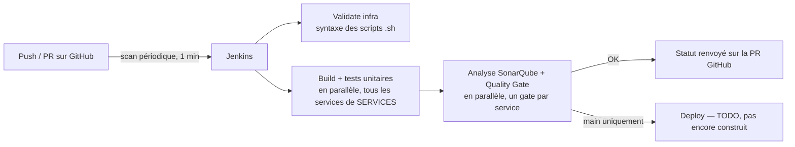

# CI/CD — Jenkins + SonarQube

[← Sommaire](00-getting-started.md)

## Démarrer en local

```bash
./scripts/start-ci.sh
```

Premier lancement : le script crée `infra/ci/.env` depuis `.env.example` et s'arrête — édite les mots de passe (admin, DB Sonar obligatoires ; `GITHUB_TOKEN`/`SONAR_TOKEN` peuvent rester vides pour l'instant), puis relance le script.

- ⚠️ Ce `.env` doit être **à côté de `docker-compose.yml`** (`infra/ci/.env`), pas dans `infra/ci/jenkins/` — Compose ne charge que celui du dossier où il tourne. Sans ça, `sonarqube-db` refuse de démarrer (mot de passe vide). Le script gère déjà ça correctement (il se place dans `infra/ci` avant de lancer Compose).

Jenkins → http://localhost:8090 · SonarQube → http://localhost:9000

## Réglages à faire une fois (pas automatisables)

### 1. Créer le job Jenkins

Item de type **Multibranch Pipeline**, pointé sur le repo GitHub, credential `github-token`.

**Behaviours à régler :**

| Réglage | Valeur | Pourquoi |
|---|---|---|
| Discover branches | `Exclude branches that are also filed as PRs` | évite de builder deux fois la même branche |
| Discover pull requests from origin | `Merging the pull request with the current target branch revision` | teste le vrai résultat du merge dans `main`, pas juste la branche isolée |
| Discover pull requests from forks | supprimé | repo public sans fork — builder des PR de forks inconnus exécuterait du code arbitraire avec accès aux secrets |

<details>
<summary>Générer le token GitHub (<code>github-token</code>)</summary>

GitHub → Settings → Developer settings → Personal access tokens → Tokens (classic) → Generate new token.

Une seule case : **`public_repo`** (pas `repo` complet — inutile, ça donnerait accès à tes repos privés). Ça suffit pour lire le code et poster les statuts de check.

Alternative plus stricte : un *fine-grained token* scopé au seul repo `travel-plan` (`Contents: Read`, `Commit statuses: Read and write`, `Metadata: Read`).

À ne pas confondre avec la "PR decoration" native de SonarQube (demande une vraie GitHub App) — optionnelle, pas nécessaire ici.
</details>

### 2. Webhook SonarQube → Jenkins

1. SonarQube démarré → génère un token (Administration → Security → Users → Tokens)
2. Colle-le dans `SONAR_TOKEN` de `infra/ci/.env`, relance `docker compose up -d`
3. SonarQube → Administration → Configuration → Webhooks → ajoute `http://jenkins:8080/sonarqube-webhook/`

**Mise à jour** : ce webhook n'est plus strictement nécessaire. Le blocage sur le Quality Gate se fait maintenant côté scanner Maven (`-Dsonar.qualitygate.wait=true`, qui sonde directement l'API SonarQube en boucle), plus via un step Jenkins `waitForQualityGate` qui, lui, dépendait du webhook. Le garder configuré ne fait pas de mal, mais si tu repars de zéro tu peux sauter cette étape.

### 3. Scan périodique

Job Multibranch → Configure → *Scan Multibranch Pipeline Triggers* → coche "Periodically if not otherwise run" → **1 minute**.

Jenkins rescanne le repo tout seul (nouvelles branches/commits), sans exposer aucun port depuis l'extérieur.

## Vue d'ensemble



## Ce qui est construit dans `infra/ci/`

- **`jenkins/Dockerfile` + `plugins.txt`** — image Jenkins avec les plugins nécessaires (Git, GitHub, Pipeline, deux plugins de vue distincts `pipeline-stage-view`/`pipeline-graph-view`, Docker Pipeline, SonarQube Scanner, Configuration as Code). Jenkins n'a **aucun accès à Docker** actuellement — `mvnw` tourne directement sur l'agent, `Validate infra` ne fait que de la syntaxe (détails plus bas).
- **`jenkins/casc.yaml`** — Configuration as Code : utilisateur admin, connexion SonarQube, credentials toujours injectés par variable d'env (jamais en dur).
- **`docker-compose.yml`** — Jenkins + SonarQube + sa base Postgres, avec un volume Maven partagé (`maven_repo` → `/var/jenkins_home/.m2`) pour ne pas retélécharger les dépendances à chaque build.

## Comment lire le Jenkinsfile

| Élément | Ce qu'il fait |
|---|---|
| `agent any` | tourne sur Jenkins lui-même, pas de machine de build séparée |
| `disableConcurrentBuilds()` | empêche deux builds du même job en parallèle |
| `checkout scm` | récupère la bonne révision (branche/PR) sans URL en dur — le même Jenkinsfile sert à tout le monde |
| `SERVICES` | liste en dur des services **réellement implémentés** (les 5 : `api-gateway`, `auth-service`, `user-service`, `travel-service`, `payment-service`) — un service rejoint la liste avec sa propre PR d'implémentation, pas avant que son code n'existe |
| `services.collectEntries { ... }` + `parallel(...)` | construit une branche parallèle par service de `SERVICES` |
| `buildService`/`sonarService` | factorisent l'appel Maven (évite de le dupliquer) ; lancent `./mvnw` **directement sur l'agent Jenkins**, pas dans un conteneur jetable |
| `withSonarQubeEnv('sonarqube')` | injecte l'URL/le token SonarQube sans les coder en dur |
| `-Dsonar.qualitygate.wait=true -Dsonar.qualitygate.timeout=300` | propriété passée directement au scanner Maven : il sonde lui-même l'API SonarQube et fait échouer le build si le Quality Gate ne passe pas — pas de step Jenkins séparé, pas de dépendance au webhook |
| `stage('Deploy')` | tourne sur **chaque** build, quelle que soit la branche — lance `ansible-playbook site.yml` sur le checkout de Jenkins, via le socket Docker de l'hôte |

Un point qui mérite plus qu'une ligne dans le tableau :

- **`org.sonarsource.scanner.maven:sonar-maven-plugin:sonar`, pas le raccourci `sonar:sonar`** — Maven ne résout les raccourcis de plugin que pour une liste de groupes connus par défaut, qui n'inclut pas SonarQube. Le raccourci seul échoue (`No plugin found for prefix 'sonar'`) sauf à modifier un `settings.xml` global sur chaque machine — les coordonnées complètes évitent ça proprement.

## Nouveau par rapport à buy-02

Voir [`nouveautes-vs-buy02.md`](nouveautes-vs-buy02.md#cicd-choresetup-jenkins) (buy-02 avait déjà Jenkins + SonarQube — ce qui change ici, c'est le multi-microservices).

## Ce qui reste à faire (hors scope de cette étape)

- Séparer tests unitaires (chaque push/PR) et tests d'intégration/E2E plus lourds (uniquement sur merge `main`), une fois qu'il y aura des tests d'intégration à faire tourner.

## Pourquoi ces choix

### Pourquoi cette étape est construite en premier
L'énoncé impose qu'une PR passe par Jenkins avant de pouvoir être mergée. Ce socle ne dépend d'aucune décision applicative (gateway, Vault...).

### Pourquoi le stage `Deploy` monte le socket Docker de l'hôte plutôt que d'utiliser Docker-in-Docker
`Deploy` a besoin de lancer `docker compose`/`ansible-playbook`, donc d'un accès à un démon Docker. Monter `/var/run/docker.sock` (Docker-outside-of-Docker) est plus simple que d'imbriquer un second démon (Docker-in-Docker) et évite de dupliquer le cache d'images. Cet accès est équivalent à un accès root sur l'hôte — acceptable ici car les PR de forks externes sont déjà exclues (voir plus haut) et que seuls les 2 contributeurs du projet peuvent pousser une branche. Le conteneur Jenkins tourne d'ailleurs en `root` (pas d'utilisateur applicatif dédié) : une fois le socket monté, la frontière de sécurité qui compte est "le socket est accessible ou non", pas l'UID interne du conteneur — inutile de complexifier le mapping de groupe Unix (`docker` GID) pour un gain de sécurité illusoire.

### Pourquoi `Deploy` tourne sur chaque build, pas seulement sur `main`
Vérifier que la stack se déploie proprement à chaque PR (pas seulement une fois mergée) attrape les régressions avant qu'elles n'atteignent `main`, plutôt qu'après. Le stage réutilise le clone que Jenkins fait déjà à chaque build (`checkout scm`), pas le dossier de travail lancé à la main — ça évite tout chemin d'hôte en dur (donc reproductible sur n'importe quelle machine CI). Tout tourne sur la même machine (même démon Docker, même nom de projet Compose que la stack lancée à la main) — assumé, une seule personne à la fois décide de ce qui tourne sur son propre poste.

### Pourquoi un scan périodique plutôt qu'un webhook
Un webhook demanderait que Jenkins soit joignable depuis internet — pas reproductible pour un coéquipier qui héberge sa propre instance. Le scan toutes les 1 minute ne demande aucune exposition réseau et reste largement assez réactif (très loin de la limite API GitHub, 5000 req/h).

### Pourquoi on build TOUS les services de `SERVICES`, à chaque fois
Une version antérieure ne buildait/scannait que les services modifiés (détectés via `git diff`), pour gagner du temps de build. En pratique, cette détection a produit plus d'angles morts réels en une session (`HEAD~1` vs diff cumulé de PR, `INFRA_CHANGED` qui ne forçait un recheck complet que si `Jenkinsfile` changeait, aucun moyen de forcer un recheck complet à la demande) que le temps qu'elle faisait gagner : à 2-3 services actifs, les builder tous en parallèle coûte à peu près le même temps que d'en builder un seul (`parallel {}` les lance simultanément). Plus simple à défendre à l'oral, zéro angle mort à expliquer.

Ça ne veut pas dire que tout `backend/*/` est buildé : `SERVICES` ne liste que les services qui ont du vrai code (voir tableau plus haut) — un dossier Spring Initializr vide (coquille sans logique) n'y entre pas tant que sa PR d'implémentation n'est pas ouverte.

### Pourquoi valider l'infra dans Jenkins
`Validate infra` tourne à chaque push, sans condition — cohérent avec la décision ci-dessus de ne plus conditionner l'exécution des stages sur ce qui a changé. `bash -n` sur chaque script `.sh` repère les erreurs de syntaxe sans rien exécuter.

On a testé une version plus poussée (`docker compose up --wait` sur toute la stack, dans un projet isolé) — elle a réellement attrapé plusieurs bugs, mais demandait que Jenkins pilote le vrai daemon Docker (proxy dédié, permissions à ajuster une par une). Le coût de maintenance dépassait le bénéfice pour un projet testé à la main par un seul développeur avant chaque merge — retour à la syntaxe seule.

*Limite assumée* : ça ne vérifie pas que les conteneurs démarrent vraiment. Si ça redevient un vrai problème (plusieurs coéquipiers actifs), la bonne réponse sera Testcontainers, pas de refaire tourner `docker compose` depuis Jenkins.

### Pourquoi le stage `Deploy` est vide
Construire des images et appeler Ansible n'a de sens que quand ces briques existent. Le stage reste présent (branché sur `main`) pour que la structure du pipeline n'ait pas à être réécrite plus tard.

### Pourquoi `mvnw` tourne directement sur Jenkins
Isoler Maven dans un conteneur jetable n'apporte rien tant que les 5 services sont des coquilles Spring Initializr sans dépendance système à isoler. Un vrai choix technique reviendra le jour où ça change — pas une contrainte.

Le Dockerfile prépare aussi `/var/jenkins_home/.m2` (`chown jenkins:jenkins` avant de repasser en `USER jenkins`) : un volume Docker neuf appartient à `root` par défaut, sinon `mvnw` échoue au premier build (`mkdir: Permission denied`) dès que `maven_repo` est vide (premier lancement, ou après un `down -v`).

### Pourquoi Jenkins n'a aujourd'hui aucun accès à Docker
Le seul besoin identifié était la version "vraie stack" de `Validate infra`, abandonnée (voir plus haut). Sans besoin réel, donner un accès Docker à Jenkins — même via un proxy restreint — ajoute une surface d'attaque pour rien. Ce choix sera revisité quand `Deploy` construira de vraies images.

### Pourquoi les tests `contextLoads()` excluent la base de données
Les 5 services partent de coquilles Spring Initializr avec un seul test généré qui démarre tout le contexte Spring — et tente donc de se connecter à une vraie base, absente sur l'agent Jenkins (pas de stack applicative ici).

- `auth-service`/`payment-service`/`user-service` excluent `DataSourceAutoConfiguration` & co. (JPA/Postgres)
- `travel-service` exclut `Neo4jAutoConfiguration` & co.

Via `@EnableAutoConfiguration(exclude = {...})` avec de **vraies classes importées**, pas une chaîne de caractères (`spring.autoconfigure.exclude=...`) : une première version utilisait les noms de package Spring Boot 2.x/3.x, invalides depuis que Boot 4 a éclaté `spring-boot-autoconfigure` en modules par techno — une chaîne pointant vers une classe inexistante est silencieusement ignorée (pas d'erreur), ce qui a laissé 3 services échouer sans message clair. Une classe importée fait échouer la compilation immédiatement si elle est déplacée/renommée.

Ces exclusions seront remplacées par de vrais tests d'intégration (Testcontainers) dès qu'un vrai repository JPA/Neo4j existera — pas par un retour à `@SpringBootTest` nu.

### Pourquoi `infra/ci/` est séparé de `backend/`
Jenkins/SonarQube (infra CI, tourne en continu) et la stack applicative n'ont ni le même cycle de vie ni les mêmes dépendances — regroupées sous `infra/` pour séparer "ce qui fait tourner le système" de "ce que fait le système" (`backend/`).

Aucun problème de connectivité : Jenkins n'a pas besoin de joindre les conteneurs applicatifs par leur nom DNS pour construire/tester du code, et le futur `Deploy` pilotera la stack via Ansible. Un test qui aurait besoin d'une vraie instance Postgres/Neo4j utilisera Testcontainers plutôt qu'une stack partagée déjà démarrée.
