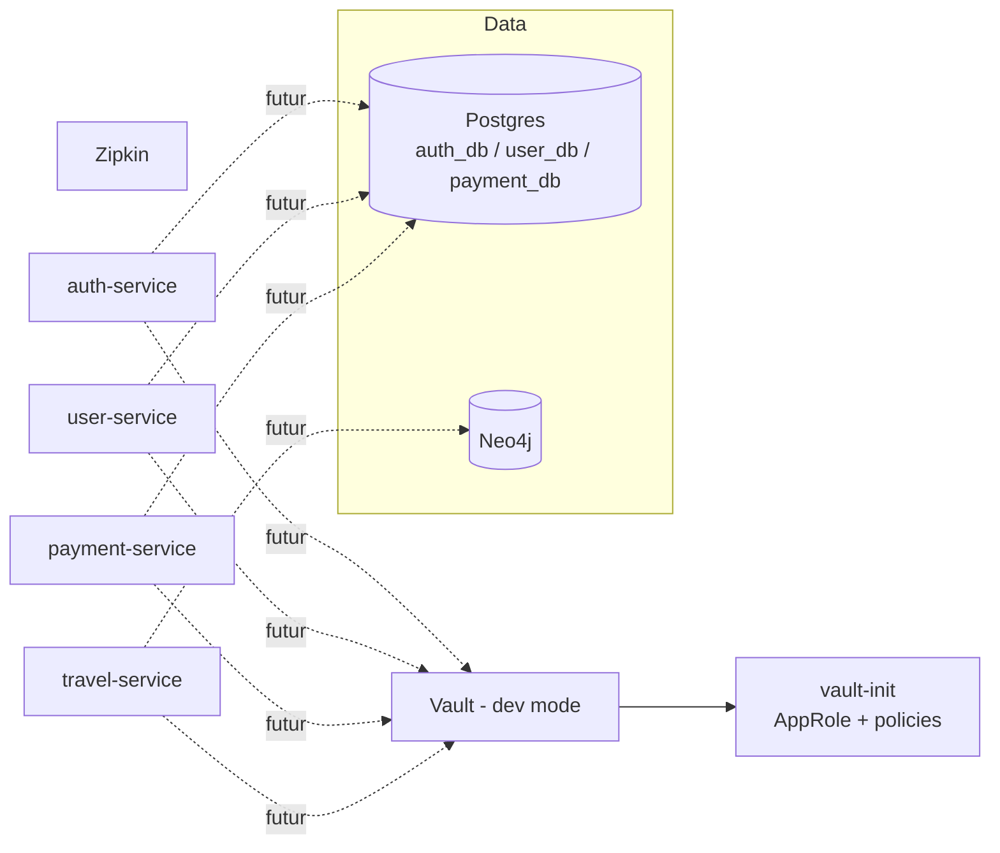

# Infrastructure applicative — Postgres, Neo4j, Vault, Zipkin

[← Sommaire](00-getting-started.md)

## Lancer la stack en local

```bash
./scripts/start-app.sh
```

Premier lancement : le script crée `.env` à la racine du repo depuis `.env.example` et s'arrête — édite les mots de passe Postgres/Neo4j/Vault (jamais commit ce fichier, seul `.env.example` est versionné), puis relance le script.

Postgres `localhost:5432` · Neo4j Browser http://localhost:7474 · Vault http://localhost:8200 · Zipkin http://localhost:9411

- Le token racine Vault (`VAULT_DEV_ROOT_TOKEN` dans `.env`) sert uniquement à se connecter à l'UI Vault en local pour vérifier ce que `vault-init` a configuré — jamais utilisé par les microservices eux-mêmes (voir plus bas).
- Les ports publiés sont paramétrables (`POSTGRES_HOST_PORT`, `NEO4J_HTTP_HOST_PORT`, etc. — voir `.env.example`), utile seulement en cas de conflit si tu fais tourner une deuxième copie de la stack. Rien à changer normalement.

## Ce qui est construit

| Service | Image | Rôle |
|---|---|---|
| `postgres` | `postgres:18-alpine` | 1 instance, 3 bases séparées créées au premier démarrage par `infra/postgres/init/init-databases.sh` (`auth_db`, `user_db`, `payment_db`), un user dédié par base, sans accès aux bases des autres services |
| `neo4j` | `neo4j:5.26` (Community, LTS 5.x) | instance unique pour `travel-service` |
| `vault` | `hashicorp/vault:2.0` | mode **dev** (auto-unseal, stockage mémoire) — voir "Pourquoi" plus bas |
| `vault-init` | `hashicorp/vault:2.0` | conteneur one-shot : active AppRole, crée une policy + un role par microservice (`infra/vault/policies/*.hcl`), chacun limité en lecture à `secret/data/<service>/*` |
| `zipkin` | `openzipkin/zipkin:3` | collecteur de traces, stockage mémoire |

Rien ne connecte encore les microservices à ces briques (pas de `spring.datasource.url`, pas de driver Neo4j, pas de client Vault) — ça viendra avec le vrai code de chaque service. Cette étape prouve juste que l'infra démarre correctement, de façon reproductible pour n'importe quel coéquipier qui clone le repo.

## Se connecter aux briques (pour développer une feature)

Depuis ta machine (host), utilise `localhost`. Depuis un autre conteneur du même `docker-compose.yml` (un microservice, une fois qu'il existera), utilise le **nom du service** — Docker le résout via le réseau `app`.

| Brique | Depuis ta machine | Depuis un conteneur |
|---|---|---|
| Postgres | `localhost:5432` | `postgres:5432` |
| Neo4j | Browser http://localhost:7474 · Bolt `localhost:7687` | `bolt://neo4j:7687` |
| Vault | http://localhost:8200 | `vault:8200` |
| Zipkin | http://localhost:9411 | `zipkin:9411` |

**Postgres** :

```bash
psql -h localhost -p 5432 -U auth_user -d auth_db
```

Depuis un futur `application.properties` : `spring.datasource.url=jdbc:postgresql://postgres:5432/auth_db`.

**Neo4j** : Browser login `neo4j` / `NEO4J_PASSWORD` (ton `.env`).

**Vault** : UI → méthode "Token", valeur = `VAULT_DEV_ROOT_TOKEN` de ton `.env`.

```bash
docker compose exec vault vault kv put secret/auth-service/test foo=bar
docker compose exec vault vault kv get secret/auth-service/test
```

<details>
<summary>Récupérer le <code>role_id</code>/<code>secret_id</code> d'un service (pour brancher un vrai microservice sur Vault)</summary>

```bash
docker compose exec vault vault read auth/approle/role/auth-service/role-id
docker compose exec vault vault write -f auth/approle/role/auth-service/secret-id
```

Pas encore fait : un service Spring lira ses secrets via `spring-cloud-starter-vault-config`, configurée avec ce `role_id`/`secret_id` — ça arrivera avec le vrai code du service, pas avant.
</details>

**Zipkin** : UI pour parcourir les traces (vide pour l'instant, aucun service n'en envoie encore). Le jour où un service en enverra, il ajoutera `micrometer-tracing-bridge-brave` + `zipkin-reporter-brave`, et `management.zipkin.tracing.endpoint=http://zipkin:9411/api/v2/spans`.

## Vue d'ensemble



## Pourquoi ces choix

### Pourquoi une seule instance Postgres avec 3 bases plutôt que 3 conteneurs
Trois conteneurs séparés respecteraient un peu mieux l'indépendance des microservices, mais coûtent 3x la RAM sur un budget serré. Une instance avec un user/une base dédiés par service garde l'essentiel de l'isolation (`auth_user` ne peut pas lire `payment_db`) sans le coût mémoire. Le script d'init est idempotent (vérifie avant de créer), rejouable sans casser une base déjà peuplée.

### Pourquoi Neo4j 5.26 plutôt que la lignée 2025.x/2026.x
5.26 est la dernière LTS de la lignée 5.x (support jusqu'à 2028) ; les versions calendaires ont un cycle de support plus court. Une base qui doit rester stable toute la durée du projet privilégie la LTS.

### Pourquoi Vault tourne en mode dev pour l'instant
Un vrai Vault de prod (stockage persistant, unseal manuel, HA) est un projet en soi, qui n'a de sens que lorsque des services réels ont des secrets à stocker. Le mode dev donne les mêmes mécanismes d'authentification/policies qu'en prod — seuls le stockage (mémoire) et l'unseal (auto) diffèrent. Ça permet de construire le vrai modèle RBAC dès maintenant, sans bloquer sur le durcissement complet (repris à l'étape Ansible/déploiement).

### Pourquoi AppRole plutôt qu'un token partagé
Le moindre privilège exclut qu'un token unique (ou partagé) soit utilisé par tous les services — un service compromis aurait alors accès aux secrets de tous les autres. AppRole donne à chaque service un couple `role_id`/`secret_id` propre, lié à une policy limitée à son propre chemin. `vault-init` crée ces roles une fois ; chaque microservice réel récupérera son `role_id`/`secret_id` via des variables d'environnement injectées par Ansible plus tard, jamais en dur dans le code.

### Pourquoi pas de replicas sur Postgres/Neo4j ici
La haute disponibilité demandée s'applique aux microservices (plusieurs instances derrière l'API Gateway), pas nécessairement aux bases d'un environnement de dev local. Répliquer Postgres ou Neo4j (cluster causal, réservé Enterprise) demande une vraie orchestration que docker-compose ne fournit pas. Ces briques restent en instance unique ici ; la réplication/HA réelle sera traitée au niveau du déploiement (Ansible/Kubernetes).
