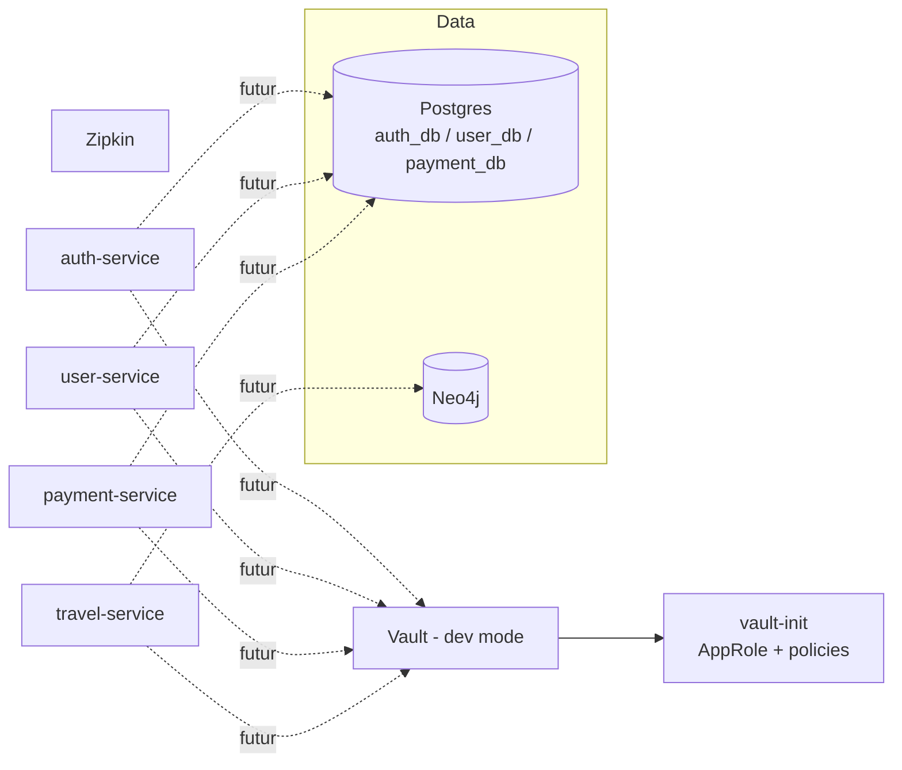

# Infrastructure applicative — Postgres, Neo4j, Vault, Zipkin

[← Sommaire](00-getting-started.md)

## Lancer la stack en local

```powershell
Copy-Item .env.example .env
# éditer .env à la racine du repo (mots de passe Postgres/Neo4j/Vault) — ne
# jamais commit ce fichier, seul .env.example est versionné
docker compose up -d --build
```

Postgres : `localhost:5432` — Neo4j Browser : http://localhost:7474 — Vault :
http://localhost:8200 — Zipkin : http://localhost:9411.

Le token racine Vault (`VAULT_DEV_ROOT_TOKEN` dans `.env`) sert uniquement à
se connecter à l'UI Vault en local pour vérifier ce que `vault-init` a
configuré — jamais utilisé par les microservices eux-mêmes (voir plus bas).

Les ports publiés (5432, 7474, 7687, 8200, 9411) sont paramétrables
(`POSTGRES_HOST_PORT`, `NEO4J_HTTP_HOST_PORT`, etc. — voir `.env.example`)
mais tu n'as normalement rien à changer : les valeurs par défaut restent ces
ports habituels. Ça sert uniquement au test automatique que fait Jenkins
(`Validate infra`, voir `01-ci-cd.md`), qui doit pouvoir lancer une copie de
cette stack sans entrer en conflit avec celle que tu fais tourner toi-même.

## Ce qui est construit

- `postgres` (image `postgres:18-alpine`) : une seule instance Postgres, mais
  trois bases séparées créées au premier démarrage par
  `infra/postgres/init/init-databases.sh` — `auth_db`, `user_db`, `payment_db`
  — chacune avec son propre utilisateur/mot de passe, sans accès aux bases
  des autres services.
- `neo4j` (image `neo4j:5.26`, édition Community, dernière LTS de la lignée
  5.x) : instance unique pour `travel-service`.
- `vault` (image `hashicorp/vault:2.0`) : lancé en mode **dev** (`-dev`,
  auto-unseal, stockage en mémoire) — voir "Pourquoi Vault tourne en mode dev"
  plus bas.
- `vault-init` : conteneur "one-shot" (démarre, exécute
  `infra/vault/bootstrap.sh`, s'arrête — pas de `restart`), qui active la
  méthode d'authentification AppRole et crée une policy + un role par
  microservice (`infra/vault/policies/*.hcl`), chacun limité en lecture à son
  propre chemin `secret/data/<service>/*`.
- `zipkin` (image `openzipkin/zipkin:3`) : collecteur de traces, stockage en
  mémoire.

Rien ne connecte encore les microservices à ces briques (pas de
`spring.datasource.url`, pas de driver Neo4j configuré, pas de client Vault) —
ça viendra avec le vrai code de chaque service. Cette étape ne fait que poser
l'infrastructure et prouver qu'elle démarre correctement, de façon reproductible
pour n'importe quel coéquipier qui clone le repo.

## Se connecter aux briques (pour développer une feature)

**Règle générale** : depuis ta machine (host), utilise `localhost` et les
ports publiés (`5432`, `7474`, `8200`, `9411`). Depuis un autre conteneur du
même `docker-compose.yml` (un microservice, une fois qu'il existera),
`localhost` ne fonctionne pas — utilise le **nom du service** comme host
(`postgres`, `neo4j`, `vault`, `zipkin`), Docker le résout automatiquement
via le réseau `app`.

**Postgres** — se connecter à une base précise avec `psql` (mots de passe
dans ton `.env`) :

```bash
psql -h localhost -p 5432 -U auth_user -d auth_db
```

Depuis un futur `application.properties` de service :
`spring.datasource.url=jdbc:postgresql://postgres:5432/auth_db`.

**Neo4j** — Browser (interface web) sur http://localhost:7474, login
`neo4j` / `NEO4J_PASSWORD` (ton `.env`). Depuis le code, connexion Bolt :
`bolt://neo4j:7687` (entre conteneurs) ou `bolt://localhost:7687` (depuis
l'host).

**Vault** — UI sur http://localhost:8200, méthode de connexion "Token",
valeur = `VAULT_DEV_ROOT_TOKEN` de ton `.env`. Pour écrire/lire un secret de
test en ligne de commande (utile pour essayer avant d'écrire du code) :

```bash
docker compose exec vault vault kv put secret/auth-service/test foo=bar
docker compose exec vault vault kv get secret/auth-service/test
```

Récupérer le `role_id`/`secret_id` d'un service (ce qu'un microservice réel
utilisera pour s'authentifier auprès de Vault) :

```bash
docker compose exec vault vault read auth/approle/role/auth-service/role-id
docker compose exec vault vault write -f auth/approle/role/auth-service/secret-id
```

Pas encore fait : un service Spring lira ses secrets via la dépendance
`spring-cloud-starter-vault-config`, configurée avec ce `role_id`/`secret_id`
— ça arrivera avec le vrai code du service, pas avant.

**Zipkin** — UI sur http://localhost:9411 pour parcourir les traces
(vide pour l'instant, aucun service n'envoie encore de données). Le jour où
un service enverra des traces, il ajoutera les dépendances
`micrometer-tracing-bridge-brave` + `zipkin-reporter-brave`, et
`management.zipkin.tracing.endpoint=http://zipkin:9411/api/v2/spans` dans sa
config.

## Vue d'ensemble



## Pourquoi une seule instance Postgres avec 3 bases plutôt que 3 conteneurs

Trois conteneurs Postgres séparés respecteraient un peu mieux l'indépendance
totale des microservices, mais coûtent 3x la RAM d'un moteur Postgres pour un
VPS à 4 Go — hors budget pour ce projet. Une seule instance avec une base et
un utilisateur dédiés par service garde l'essentiel de l'isolation
(`auth_user` ne peut pas lire `payment_db`, aucune table partagée) sans le
coût mémoire, et le script d'init est idempotent (vérifie l'existence avant
de créer) pour pouvoir être rejoué sans casser une base déjà peuplée.

## Pourquoi Neo4j 5.26 plutôt que la lignée calendaire 2025.x/2026.x

Neo4j 5.26 est la dernière version LTS de la lignée 5.x (support jusqu'à
2028) ; les versions 2025.x/2026.x reçoivent les nouveautés mais avec un
cycle de support plus court. Pour un projet dont la base doit rester stable
sur toute sa durée, la LTS est le choix qui minimise les montées de version
imprévues.

## Pourquoi Vault tourne en mode dev pour l'instant

Un vrai Vault de production (stockage persistant, unseal manuel avec
plusieurs clés, haute disponibilité) est un projet en soi et n'a de sens que
lorsque des services réels ont des secrets à y stocker. Le mode dev
(`-dev`) donne un Vault fonctionnel immédiatement, avec les mêmes mécanismes
d'authentification et de policies qu'en production — seul le stockage
(mémoire, perdu à chaque redémarrage) et l'unseal (automatique) diffèrent.
Ça permet de construire et tester dès maintenant le vrai modèle RBAC
(policies + AppRole par service) sans bloquer sur l'aspect "vrai serveur
Vault durci", qui sera repris à l'étape Ansible/déploiement.

## Pourquoi AppRole plutôt qu'un token partagé

Le principe du moindre privilège demandé par l'énoncé exclut qu'un seul
token racine (ou un token partagé entre services) soit utilisé par tous les
microservices — n'importe quel service compromis aurait alors accès aux
secrets de tous les autres. AppRole donne à chaque service un couple
`role_id`/`secret_id` propre, lié à une policy qui ne l'autorise à lire que
son propre chemin (`secret/data/<service>/*`). `vault-init` crée ces roles
une fois, au démarrage de la stack ; chaque microservice réel récupérera son
`role_id`/`secret_id` (via variables d'environnement injectées par Ansible
plus tard, jamais en dur dans le code) le jour où il consommera effectivement
des secrets Vault.

## Pourquoi pas de replicas sur Postgres/Neo4j ici

La haute disponibilité demandée par l'énoncé s'applique aux microservices
(plusieurs instances derrière l'API Gateway, load balancing, failover) — pas
nécessairement aux bases de données d'un environnement de développement local.
Répliquer Postgres (streaming replication, Patroni) ou Neo4j (cluster causal,
réservé à l'édition Enterprise) correctement demande une vraie orchestration
que docker-compose n'est pas fait pour fournir. Ces briques restent en
instance unique ici ; la réplication/HA réelle sera traitée au niveau du
déploiement (Ansible/Kubernetes), pas dans ce docker-compose de développement.
