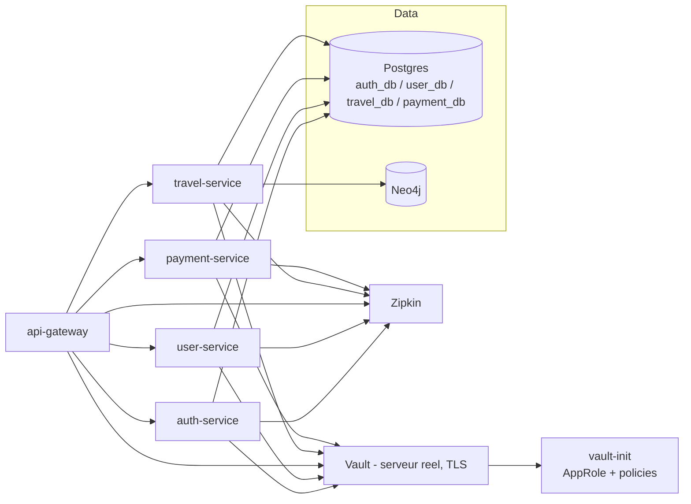

# Infrastructure applicative — Postgres, Neo4j, Vault, Zipkin

[← Sommaire](00-getting-started.md)

## Lancer la stack en local

```bash
./scripts/start-app.sh
```

Premier lancement : le script crée `.env` à la racine du repo depuis `.env.example` et s'arrête — édite les mots de passe Postgres/Neo4j/Vault (jamais commit ce fichier, seul `.env.example` est versionné), puis relance le script.

Postgres `127.0.0.1:5434` (5432 en interne — 5434 côté host pour éviter un conflit de port local, voir commentaire dans `docker-compose.yml`) · Neo4j Browser http://localhost:7474

- **Vault n'est plus accessible depuis l'host** (durcissement réseau, cf. `08-ansible-deploy-tls.md`) : plus de port publié, plus de token racine à connaître pour l'usage courant. Toutes les commandes passent par `docker compose exec vault vault ...` (voir plus bas) ; le vrai `VAULT_ROOT_TOKEN` est régénéré à froid par `ansible/playbooks/vault-unseal.yml` et écrit dans `.env`, jamais fixe.
- Les ports publiés sont paramétrables (`POSTGRES_HOST_PORT`, `NEO4J_HTTP_HOST_PORT`, etc. — voir `.env.example`), utile seulement en cas de conflit si tu fais tourner une deuxième copie de la stack. Rien à changer normalement.

## Ce qui est construit

| Service | Image | Rôle |
|---|---|---|
| `postgres` | `postgres:18-alpine` | 1 instance, 4 bases séparées créées au premier démarrage par `infra/postgres/init/init-databases.sh` (`auth_db`, `user_db`, `travel_db`, `payment_db`), un user dédié par base, sans accès aux bases des autres services |
| `neo4j` | `neo4j:5.26` (Community, LTS 5.x) | instance unique pour `travel-service` |
| `vault` | `hashicorp/vault:2.0` | mode **serveur réel** (storage `file` persistant, listener TLS) — durci depuis le mode dev initial, voir "Pourquoi" plus bas |
| `vault-init` | `hashicorp/vault:2.0` | conteneur one-shot : active AppRole, crée une policy + un role par microservice (`infra/vault/policies/*.hcl`), chacun limité en lecture à `secret/data/<service>/*` |
| `zipkin` | `openzipkin/zipkin:3` | collecteur de traces, stockage mémoire |

Les 5 microservices (`auth-service`, `user-service`, `travel-service`, `payment-service`, `api-gateway`) sont branchés sur Vault (AppRole) et Zipkin (traces). `travel-service` écrit aussi dans Neo4j (graphe de destinations) en plus de Postgres. Les 4 bases Postgres (`auth_db`, `user_db`, `travel_db`, `payment_db`) sont toutes utilisées.

## Se connecter aux briques (pour développer une feature)

Depuis ta machine (host), utilise `localhost`. Depuis un autre conteneur du même `docker-compose.yml` (un microservice), utilise le **nom du service** — Docker le résout via le réseau `app`.

| Brique | Depuis ta machine | Depuis un conteneur |
|---|---|---|
| Postgres | `127.0.0.1:5434` | `postgres:5432` |
| Neo4j | Browser http://localhost:7474 · Bolt `localhost:7687` (chiffré, `bolt+ssc://`) | `bolt+ssc://neo4j:7687` |
| Vault | non exposé sur l'host — `docker compose exec vault vault ...` uniquement | `vault:8200` (HTTPS, cert auto-signé) |
| Zipkin | non exposé sur l'host non plus (même durcissement) — `docker compose exec zipkin wget -qO- http://localhost:9411/...` uniquement | `zipkin:9411` |

**Postgres** :

```bash
psql -h 127.0.0.1 -p 5434 -U auth_user -d auth_db
```

Depuis `application.properties` (interne au réseau Docker) : `spring.datasource.url=jdbc:postgresql://postgres:5432/auth_db?sslmode=require`.

**Neo4j** : Browser login `neo4j` / `NEO4J_PASSWORD` (ton `.env`).

**Vault** : plus d'UI accessible depuis l'host (port 8200 non publié, durcissement réseau). Toutes les opérations passent par le CLI à l'intérieur du conteneur :

```bash
docker compose exec vault vault kv put secret/auth-service/test foo=bar
docker compose exec vault vault kv get secret/auth-service/test
```

<details>
<summary>Récupérer le <code>role_id</code>/<code>secret_id</code> d'un service (déjà fait automatiquement en déploiement, utile seulement pour du debug manuel)</summary>

```bash
docker compose exec vault vault read auth/approle/role/auth-service/role-id
docker compose exec vault vault write -f auth/approle/role/auth-service/secret-id
```

En déploiement réel, `ansible/playbooks/fetch-vault-secrets.yml` fait exactement ça pour les 5 services et écrit le résultat dans `.env`. Côté code, chaque service lit ses secrets via un `VaultClient.java` maison (`RestClient` + login AppRole), pas `spring-cloud-starter-vault-config` — dépendance jugée trop lourde pour le besoin, même logique que le choix fait pour Stripe/PayPal (voir `07-payment-service.md`).
</details>

**Zipkin** : alimentée en continu par les 5 microservices (`management.tracing.export.zipkin.endpoint`, dépendance `spring-boot-starter-zipkin`). Pas d'UI accessible depuis l'host (port non publié, même durcissement que Vault) — interroger l'API depuis l'host via le conteneur :

```bash
docker compose exec zipkin wget -qO- "http://localhost:9411/api/v2/traces?serviceName=travel-service&limit=1" | jq .
```

Détail d'une commande lisible (traceId + service + span, triés chronologiquement) → `10-audit-demo-guide.md`, section "Can you track and trace a request across multiple services easily?".

## Vue d'ensemble



## Nouveau par rapport à buy-02

Voir [`nouveautes-vs-buy02.md`](nouveautes-vs-buy02.md#infra-applicative-choresetup-app-infra) (Vault, Zipkin, stack Docker Compose multi-conteneurs — rien de tout ça n'existait sur buy-02).

## Pourquoi ces choix

### Pourquoi une seule instance Postgres avec 4 bases plutôt que 4 conteneurs
Quatre conteneurs séparés respecteraient un peu mieux l'indépendance des microservices, mais coûtent 4x la RAM sur un budget serré. Une instance avec un user/une base dédiés par service garde l'essentiel de l'isolation (`auth_user` ne peut pas lire `payment_db`) sans le coût mémoire. Le script d'init est idempotent (vérifie avant de créer), rejouable sans casser une base déjà peuplée.

### Pourquoi Neo4j 5.26 plutôt que la lignée 2025.x/2026.x
5.26 est la dernière LTS de la lignée 5.x (support jusqu'à 2028) ; les versions calendaires ont un cycle de support plus court. Une base qui doit rester stable toute la durée du projet privilégie la LTS.

### Pourquoi Vault a d'abord tourné en mode dev, avant d'être durci
Au moment de brancher les premiers services, un vrai Vault de prod (stockage persistant, unseal manuel, HA) n'avait pas encore de sens — aucun secret réel à protéger tant que le reste de la stack n'existait pas. Le mode dev donnait les mêmes mécanismes d'authentification/policies qu'en prod, seuls le stockage (mémoire) et l'unseal (auto) différaient, ce qui a permis de construire le vrai modèle RBAC (AppRole, policies scopées) sans bloquer sur le durcissement complet. Ce durcissement a depuis été fait à l'étape Ansible/déploiement : storage `file` persistant, listener TLS, init/unseal réel à froid — détaillé dans `08-ansible-deploy-tls.md` ("Pourquoi Vault ne tourne plus en mode dev").

### Pourquoi AppRole plutôt qu'un token partagé
Le moindre privilège exclut qu'un token unique (ou partagé) soit utilisé par tous les services — un service compromis aurait alors accès aux secrets de tous les autres. AppRole donne à chaque service un couple `role_id`/`secret_id` propre, lié à une policy limitée à son propre chemin. `vault-init` crée ces roles une fois ; chaque microservice reçoit ensuite son `role_id`/`secret_id` via des variables d'environnement injectées par `ansible/playbooks/fetch-vault-secrets.yml`, jamais en dur dans le code.

### Pourquoi pas de replicas sur Postgres/Neo4j ici
La haute disponibilité demandée s'applique aux microservices (plusieurs instances derrière l'API Gateway), pas nécessairement aux bases d'un environnement de dev local. Répliquer Postgres ou Neo4j (cluster causal, réservé Enterprise) demande une vraie orchestration que docker-compose ne fournit pas. Ces briques restent en instance unique ici ; la réplication/HA réelle sera traitée au niveau du déploiement (Ansible/Kubernetes).
